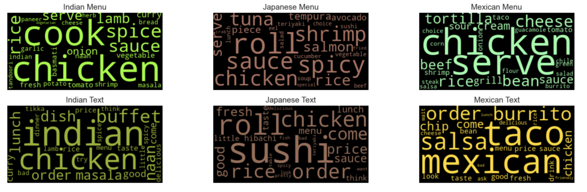
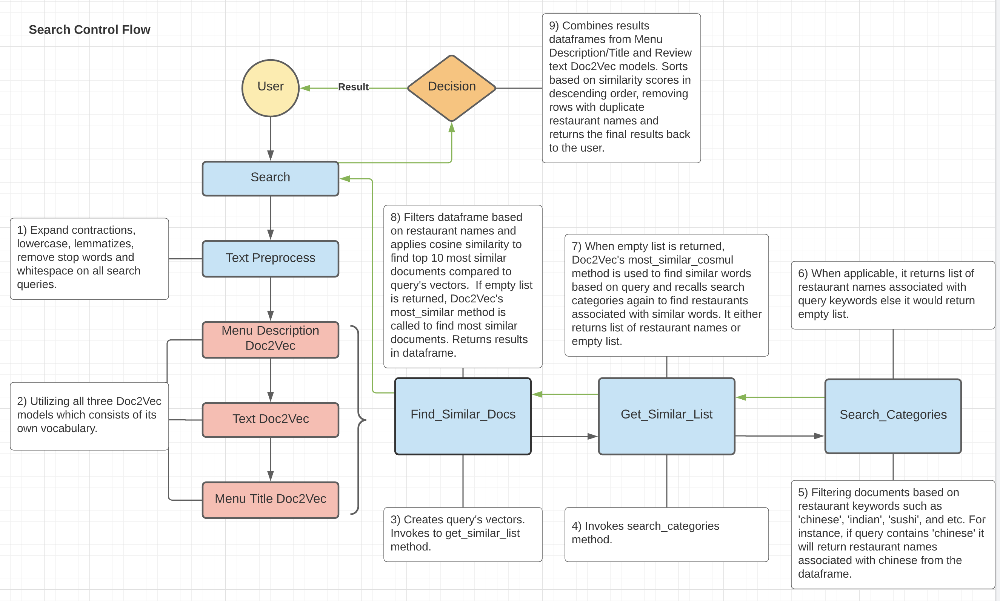

# NLP Restaurant Search Engine
## Objective
Search engines are everywhere such as in e-commerce, social media, education, and general sites and they are frequently used daily by almost everyone around the world. Although restaurant search engines aren't unique and exist already in Yelp and other business review sites; I always wondered how search engines are built and processed. This project is my take on populating accurate restaurant listings using multiple datasets through natural language processing which I aim to provide specific results based on user’s search input whether it’s general search term (i.e. ‘I want Chinese food’ ) or more specific (i.e. ‘guacamole with picadillo).

## Target Audience
The project is geared towards food enthusiasts and travelers looking for specific taste and atmosphere, however it can be also useful for the general population looking for places to dine or take-out. 

## Dataset
In this project, I am using multiple datasets relating to restaurants, food/ingredients, and menu items. Yelp's dataset is used for getting businesses, reviews, and tips datasets which contain a wealth of restaurants’ text information. Yummly's dataset is used for referencing each cuisine’s ingredient list. Lastly, I web-scraped restaurant menu data from Allmenus, which contains valuable food/drink menu information. Below are the summary for each datasets:

**Yelp Dataset**
- 8,021,122 reviews 
- 209,393 businesses
- 1,320,710 tips
- Over 1.4 million business attributes.

**Yummly Dataset**
- 20 cuisines (Korean, Spanish, etc.)
- 36,568 ingredients

**Allmenus**
- 12,000+ restaurants
- 1,000,000+ menus 

## Executive Summary
Cleaned and organized multiple text data sources through text pre-processing (tokenizing, lemmatizing, lowercase, etc.) and performed data analysis through visualizations using Gensim, heatmap, WordCloud, LDA model and various graphs. Created three Doc2Vec models (review texts, menu description text, and menu title text) after tuning hyperparameters best suited for this project to find most similar documents based on user's search input.

### Key findings
- Out of 1,199 restaurants gathered through Yelp's and Allmenus' data, top three cuisines were 'Chinese' (25%), 'Italian' (21%), and 'Mexican' (19%). 
- Majority of reviews had positive sentiment analysis with average compound score had higher than 0.05 (positive sentiment: compound score >= 0.05)
- Removing or combining negative reviews with positive reviews made no difference in improving search results based on Doc2Vec's most similar method.
- Review text count had outliers with few reviews having more than 3,000 text counts while some only have 100 or less. Similarly, menu description word count flutuated between 2 to 20 or more. 
- Based on unigrams, bigrams, and trigrams, the top 10 most common words were flour, spicy, tortilla, sauce, and milk related terms.

### Search Engine Performance
Utilized three Doc2Vec models and TF-IDF model in producing coherent similar documents.

- Doc2Vec models' word embeddings evaluated positively which returned coherent results. For instance, 'pho' keyword returned 'Vietnamese', 'Vermicelli', 'Saigon', and etc. as its most similar words.
- Both Doc2Vec models and TF-IDF model provided coherent search result, Doc2Vec provided effective semantic similarity between words and documents while TF-IDF models provided result based on keywords listed on matrix data. 

Below is Doc2Vec control flow chart which describes how results came about:

I built two search engines using Doc2Vec and TF-IDF. Three Doc2Vec models are created and trained using menu text values and Yelp's review text values. Unlike the TF-IDF approach, Doc2Vec models are achieved in identifying semantic proximity between words/documents and finding the meaning of the words. Although the TF-IDF search engine provided coherent results, it only looks for words that are listed in keywords that match the document, in other words, it does not perform well when never seen words are inputted. Overall, Doc2Vec is a useful algorithm in finding meaning of the documents, however results may vary based on hyper-parameters which require some tinkering.

## Further Readings
[Full Report](https://github.com/Suykim21/nlp_restaurant_search_engine/blob/main/reports/capstone_two_report.pdf)

